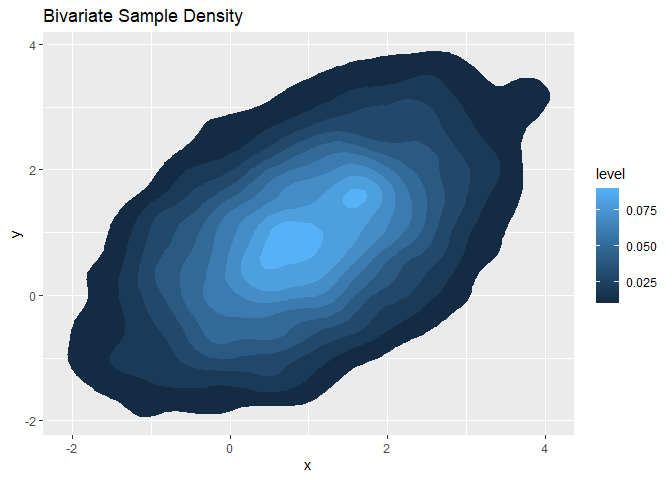
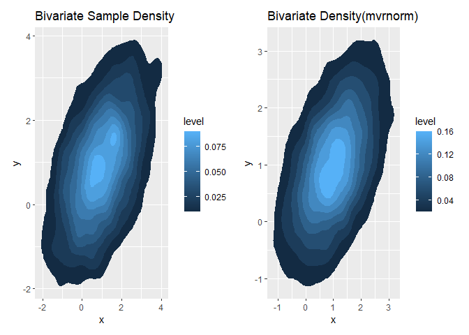
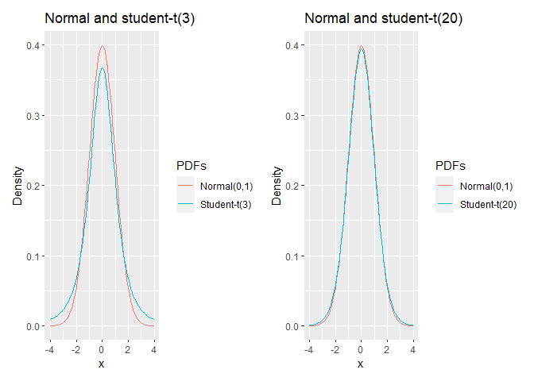
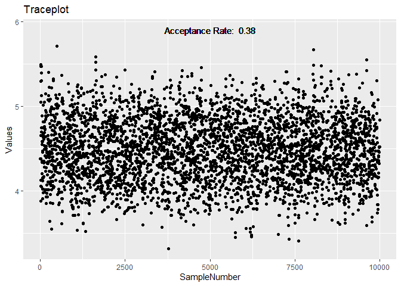
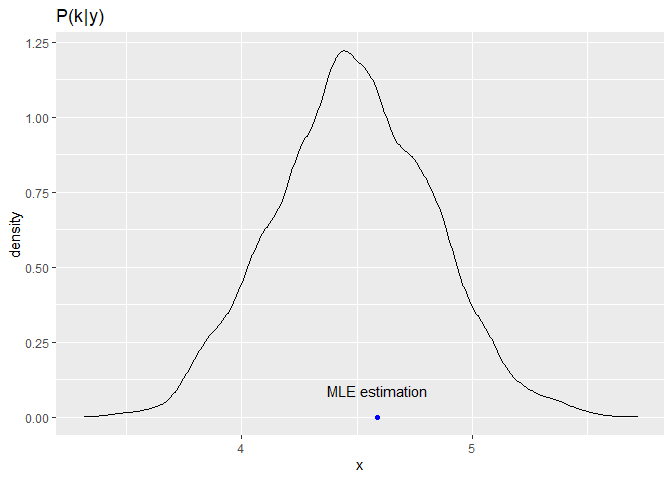
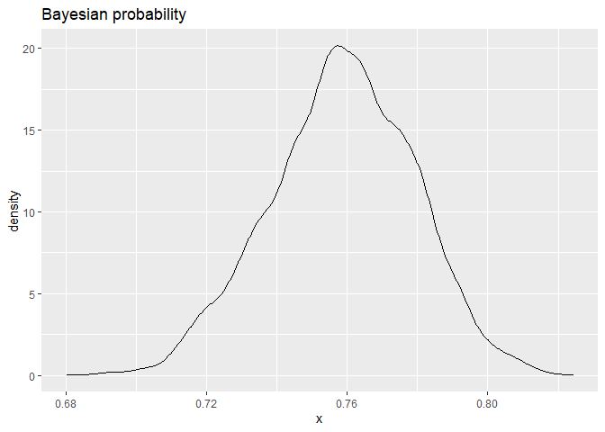
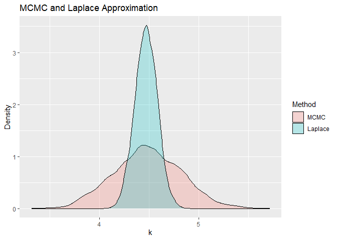

Statisitical Programming - Simulation-Bayesian inference
================
Angelos Papanastasiou

## Question 1

The PDF of a bivariate Gaussian distribution has the following form

![P(x,y)=\\frac{1}{2\\pi\\sigma\_{x}\\sigma\_{y}\\sqrt{1-\\rho^2}}exp(-\\frac{1}{2(1-\\rho^2)}\[\\frac{(x-\\mu\_{x})^2}{(\\sigma\_{x})^2}+\\frac{(y-\\mu\_{y})^2}{(\\sigma\_{y})^2}-\\frac{2\\rho(x-\\mu\_{x})(y-\\mu\_{y})}{\\sigma\_{x}\\sigma\_{y}}\])](https://latex.codecogs.com/png.latex?P%28x%2Cy%29%3D%5Cfrac%7B1%7D%7B2%5Cpi%5Csigma_%7Bx%7D%5Csigma_%7By%7D%5Csqrt%7B1-%5Crho%5E2%7D%7Dexp%28-%5Cfrac%7B1%7D%7B2%281-%5Crho%5E2%29%7D%5B%5Cfrac%7B%28x-%5Cmu_%7Bx%7D%29%5E2%7D%7B%28%5Csigma_%7Bx%7D%29%5E2%7D%2B%5Cfrac%7B%28y-%5Cmu_%7By%7D%29%5E2%7D%7B%28%5Csigma_%7By%7D%29%5E2%7D-%5Cfrac%7B2%5Crho%28x-%5Cmu_%7Bx%7D%29%28y-%5Cmu_%7By%7D%29%7D%7B%5Csigma_%7Bx%7D%5Csigma_%7By%7D%7D%5D%29
"P(x,y)=\\frac{1}{2\\pi\\sigma_{x}\\sigma_{y}\\sqrt{1-\\rho^2}}exp(-\\frac{1}{2(1-\\rho^2)}[\\frac{(x-\\mu_{x})^2}{(\\sigma_{x})^2}+\\frac{(y-\\mu_{y})^2}{(\\sigma_{y})^2}-\\frac{2\\rho(x-\\mu_{x})(y-\\mu_{y})}{\\sigma_{x}\\sigma_{y}}])")

In order to simulate samples from the bivariate distribution we divide
the task into 2 parts.First, we create a function tha computes the
density. Then using the random walk Metropolis Hastings with Normal
distribution proposals we simulate 10000 samples from the distribution.

``` r
#Create the function
bivariate <- function(y1,y2) {
  mu1 <- 1
  mu2 <- 1
  r=0.5
  s1=1
  s2=1
  constant <- 1/sqrt(2*pi*sqrt(1-r^2))
  return(constant*exp(-(1/2*(1-r^2)) * (((y1-mu1)^2)/s1^2+((y2-mu2)^2)/s2^2-(2*r*(y1-mu1)*(y2-mu2))/(s1*s2))))
}

##MCMC algorithm
n <- 10100 #number of samples to draw
ys1 <- numeric(n)
ys2 <- numeric(n)
#initialize values
ys1[1] <- 0
ys2[2] <- 0
for (i in 2:n) {
  proposal1 <- ys1[i-1] + rnorm(1,0,1)
  proposal2 <- ys2[i-1] + rnorm(1,0,1)
  a <- bivariate(proposal1,proposal2)/bivariate(ys1[i-1],ys2[i-1])
  if (runif(1,0,1) < a) { # accept y with probability = a
    ys1[i] <- proposal1
    ys2[i] <- proposal2
  } else {
    ys1[i] <- ys1[i-1]
    ys2[i] <-ys2[i-1]
  }
}
ys1 <- ys1[-c(1:100)]
ys2 <- ys2[-c(1:100)]
```

``` r
#create a dataframe so we can use ggplot
data1=data.frame('x'=ys1,'y'=ys2)
#density function
p <- ggplot(data1, mapping = aes(x = x, y = y)) +
  ggtitle('Bivariate Sample Density')+ 
  stat_density_2d(aes(fill = ..level..), geom = "polygon") 
p
```

<!-- -->

As it can be seen, most of our data points is close to (1,1).That was
expected as the mean of the bivariate Gaussian we were simulating was
(1,1).We can also observed that the shape is somehow elliptical with a
slope to the right this is a consequense of the positive correlation
between the 2 variables.In order to check how good are simulation was we
can compare our results with the results that `mvrnorm` function will
give.

``` r
#define mean an covariance matrix
mu=c(1,1)
sigma=matrix(c(1,0.5,0.5,1),nrow = 2,ncol=2)
#simulate values
Normalvalues = mvrnorm(10000,mu,sigma)
#create dataframe in order to use ggplot
datanormal = data.frame(x=Normalvalues[,1],y=Normalvalues[,2])
#create the plot
p1 <- ggplot(datanormal, mapping = aes(x = x, y = y)) +
      ggtitle('Bivariate Density(mvrnorm)')+ 
      stat_density_2d(aes(fill = ..level..), geom = "polygon") 
p+p1
```

<!-- -->

As we can observe the two density plots are similar.

## Question 2

Student-t distribution has the following form

 = \\frac{\\Gamma(\\frac{\\nu+1}{2})}{\\sqrt{\\nu\\pi\\Gamma(\\frac{\\nu}{2})}}(1+\\frac{x^2}{\\nu})^\\frac{-\\nu+1}{2}")

Where  are the
degrees of freedom.The Variance of the student-t is given by  so for question 2.1 the theoretical
variance is equal to 1.11 and for question 2.2 is 3.The Metropolis
hasting algorithm was used in order to simulate 10000 samples from a
student-t distribution with 3 and 20 degrees of freedom.

### 2.1

``` r
#create the function
dstudentt <-function(y) {
  v <- 20
  return(gamma((v+1)/2)/(sqrt(v*pi)*gamma(v/2)) *
           (1+(y^2)/v)^(-(v+1)/2))
}

#MCMC
set.seed(1)
n <- 10100 #number of samples to draw
ys <- numeric(n)
ys[1] <- 0 #initial value
for (i in 2:n) {
  y <- ys[i-1] + rnorm(1,0,1)
  a <- dstudentt(y)/dstudentt(ys[i-1])
  if (runif(1,0,1) < a) { # accept y with probability = a
    ys[i] <- y
  } else {
    ys[i] <- ys[i-1]
  }
}
ys <- ys[-c(1:100)]

#compute the variance of our sample
variance=var(ys)
#compute theoretical variance
theoretical=20/18
```

| Sample.Variance | Theoritical.variance |
| --------------: | -------------------: |
|        1.075455 |             1.111111 |

### 2.2

``` r
dstudentt <-function(y) {
  v <- 3
  return(gamma((v+1)/2)/(sqrt(v*pi)*gamma(v/2)) *
           (1+(y^2)/v)^(-(v+1)/2))
}

n <- 10100 #number of samples to draw
ys <- numeric(n)
ys[1] <- 0 #initial value
for (i in 2:n) {
  y <- ys[i-1] + rnorm(1,0,1)
  a <- dstudentt(y)/dstudentt(ys[i-1])
  if (runif(1,0,1) < a) { # accept y with probability = a
    ys[i] <- y
  } else {
    ys[i] <- ys[i-1]
  }
}
ys <- ys[-c(1:100)]

variance = var(ys)
theoretical=3
```

| Sample.Variance | Theoritical.variance |
| --------------: | -------------------: |
|         1.88232 |                    3 |

As we can observe the variance of the sample that was simulated from the
student-t distribution with 20 degrees of freedom is very close to the
theoretical variance while the variance of the sample that was simulated
from the student-t distribution with 3 degrees of freedom is not as much
close.In order to understand the reason we can plot the Probability
density functions of the student-t distributions in the same plot with
the normal distribution that was used for the proposal.

``` r
x=seq(-4,4,0.1)
hx=dnorm(x)
normalvalues = data.frame(x=x,'density'=hx)
hx1 = dt(x,3)
studentvalues3 = data.frame(x=x,'density'=hx1)
hx2 = dt(x,20)
studentvalues20 = data.frame(x=x,'density'=hx2)
p1=ggplot() + 
  geom_line(data = normalvalues, aes(x = x, y = density, color = "blue")) +
  geom_line(data = studentvalues3, aes(x = x, y = density,color = "red")) +
  xlab('x') +
  ylab('Density')+ggtitle('Normal and student-t(3)')+
  scale_color_discrete(name = "PDFs", labels = c("Normal(0,1)", "Student-t(3)"))
p2=ggplot() + 
  geom_line(data = normalvalues, aes(x = x, y = density, color = "blue")) +
  geom_line(data = studentvalues20, aes(x = x, y = density, color = "red")) +
  xlab('x') +
  ylab('Density')+ggtitle('Normal and student-t(20)')+
  scale_color_discrete(name = "PDFs", labels = c("Normal(0,1)", "Student-t(20)"))
p1+p2
```

<!-- -->

As it can be seen from the plots above Normal distribution struggles to
propose values that are at the tails of the student-t(3) probability
density function. Instead of that it proposes values with smaller
variance.This is the reason why our sample variance is smaller than the
theoretical one in the first case. From the second plot we can observe
that Normal distribution and student-t(20) probability density functions
are almost the same,thus we are getting a sample variance close to the
theoretical one.

## Question 3

``` r
y = scan("data/eventtimes.csv", sep=",")
```

Weibull function has parameters
 and
.Both have to be positive so we have to consider that when
writing our log-likelihood function.The function will give an error
message,whenever the user gives a negative value.

### 3.1

``` r
#function for the log likelihood
weibullloglik <- function(k, y, lambda) {
if (k<=0 | lambda<=0){stop('Parameters must be positives')}
n <- length(y)
return(n*log(k) - k*n*log(lambda) + (k-1)*sum(log(y)) - sum( (y/lambda)^k))
}
```

### 3.2

Since there is not an analytical solution for the estimation of the
maximum likelihood estimator we will use an optimization method to
estimate it. Note that the are different optimization procedures for the
computation of the minimum of a function. For this example, the
optimization method named L-BFGS-B was used as other methods could give
negative results or converge to local minimums.L-BFGS-B gives you the
opportunity to set lower and upper bounds for the values of the
parameter.Lower bound was set to 0 as
 can
only be positive.

``` r
#find the optimal k 
initval <- 1
optimal = optim(initval,weibullloglik,lambda=2,y=y,control = list(fnscale=-1),method = "L-BFGS-B",lower = 0)
bestk=optimal$par
```

### 3.3

The `pweibull` function was used in order to obtain ")

``` r
prob = pweibull(1.5, shape = bestk, scale = 2, lower.tail = FALSE, log.p = FALSE)
```

Given that it rained today the probability of there being more than 1.5
weeks until the next time that rain occurs is 0.7655807

### 3.4

``` r
#gamma probability function
gammadist <- function(k,theta,x){
  return(1/(gamma(k)*theta^k)*x^(k-1)*exp(-x/theta))
}

#log posterior
logposterior <- function(k,y,lambda) {
  if(k<=0|lambda<=0){stop('Parameters must be positives')}
  return(log(gammadist(1,1,k))+weibullloglik(k,y,2))
}
```

### 3.5

To simulate from the posterior distribution
") MCMC algorithm was used.Note that negatives values for k
can be proposed.In the previous question when we defined the log
posterior an error was introduced when a negative values was given.This
would create problem in the MCMC algorithm in the step where the
probability of acceptance is computed for negative proposed values. To
deal with this problem the log posterior is modified as shown below.

``` r
#log posterior
logposterior <- function(k,y,lambda) {
  if(k<=0|lambda<=0){return(-Inf)}
  return(log(gammadist(1,1,k))+weibullloglik(k,y,2))
}
```

With this modification when negatives values are proposed the acceptance
probability will be 0 so the values will be rejected.

``` r
numAccepted <- 0
n <- 10100 #number of samples to draw
ks <- numeric(n)
ks[1] <- 4 #initial value
for (i in 2:n) {
  proposal <- ks[i-1] + rnorm(1,0,1)
  a <- min(1,exp(logposterior(proposal,y,2)-logposterior(ks[i-1],y,2)))
  if (runif(1,0,1) < a) { # accept y with probability = a
    ks[i] <- proposal
    numAccepted <- numAccepted + 1 # compute the acceptance rate
  } else {
    ks[i] <- ks[i-1]
  }}
acceptanceRate <- numAccepted/n
ks <- ks[-c(1:100)]
mean=mean(ks)
median=median(ks)
std=sd(ks)
```

|     Mean |  Median | Standard.deviation | MLE.estimation |
| -------: | ------: | -----------------: | -------------: |
| 4.484106 | 4.47739 |          0.3408063 |       4.588589 |

In order to see how the MCMC algorithm is working we can check its trace
plot.Also in theory we pick
 to give us an acceptance rate close to 0.40.This is indeed
happening in our case.

``` r
SampleNumber = c(1:length(ks))
traceplot = data.frame("Values" = ks,'SampleNumber'=SampleNumber)
ggplot(traceplot,aes(x=SampleNumber,y=Values))+
geom_point()+ggtitle('Traceplot')+ 
geom_text(aes(5000, 5.9, label=paste("Acceptance Rate: ",round(acceptanceRate,2) )))
```

<!-- -->

We can plot the density function of our samples to get an idea of how to
posterior looks like and compare it with the MLE estimation of question
3.2

``` r
values = data.frame(x=ks)
ggplot(values,aes(x))+geom_density()+ggtitle('P(k|y)')+
  annotate("point", x = bestk, y = 0, colour = "blue")+
  annotate("text", x = bestk, y = 0.09, label = "MLE estimation")
```

<!-- -->

### 3.6

``` r
i=1
probs=numeric(length(ks))
for (k in ks){
  probs[i]=pweibull(1.5, shape = k, scale = 2, lower.tail = FALSE, log.p = FALSE)
  i=i+1
}
mean = mean(probs)
std = sd(probs)
```

In order to estimate the bayesian probability we take the average of the
the vector probs.

| Bayesian.probability | Standard.Deviation |
| -------------------: | -----------------: |
|            0.7586393 |          0.0205135 |

To illustrate this better we can plot the density function.

``` r
values = data.frame(x=probs)
ggplot(values,aes(x))+geom_density()+ggtitle('Bayesian probability')
```

<!-- -->

The standard deviation is quite small.Most of the values ranges between
0.70 and 0.80.

### 3.7

``` r
n <- 10000 #number of samples to draw
maxks=optim(4,logposterior,lambda = 2,y=y,control=list(fnscale=-1),method="L-BFGS-B",lower=0,hessian = TRUE)
#mean of the Normal distribution
kbest=maxks$par
#standard deviation of the Normal distribution
sigma=-1/maxks$hessian
#sample 10000 values
laplacevalues=rnorm(10000,kbest,sigma)
mean=mean(laplacevalues)
std=sd(laplacevalues)
```

|     mean |       std |
| -------: | --------: |
| 4.469668 | 0.1135122 |

### 3.8

``` r
densityvalues = data.frame('MCMC'=ks,'Laplace'=laplacevalues)
data = melt(densityvalues)
```

    No id variables; using all as measure variables

``` r
names(data)[names(data) == "variable"] <- "Method"
```

``` r
ggplot(data,aes(x=value, fill=Method)) + geom_density(alpha=0.25)+
  xlab('k')+
  ylab('Density')+
  ggtitle('MCMC and Laplace Approximation')
```

<!-- -->
